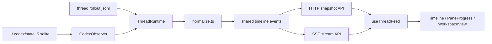

# AGENTS.md

本文件面向在本仓库内工作的代理、贡献者和维护者，目标是两件事：

1. 快速理解工程结构和真实数据流。
2. 在继续演进 UI / 事件归一化 / 多会话工作区时，保持关键行为稳定，不把产品重新做成一个“二次封装的 Codex CLI”。

## 项目定位

`codex-sidecar` 是一个 **面向本地 Codex CLI 的伴随式 GUI**。

它当前的核心思路不是“在 GUI 中重写一套 Codex 调用链”，而是：

- 用户继续在终端里使用原生 Codex CLI
- 服务端读取本机 Codex 状态库与 rollout 日志
- 前端把事件流渲染成更适合阅读和多工程切换的工作台

这条约束非常重要。除非有明确的新设计，否则不要把主链路改造成“GUI 主导调用 Codex”。

## 快速入口

首次进入代码库时，优先读下面这些文件：

- `src/server/index.ts`
  - HTTP API 和 SSE 入口
  - 生产环境静态资源入口
- `src/server/observer/CodexObserver.ts`
  - 项目 / 线程聚合
  - `ThreadRuntime` 生命周期管理
- `src/server/observer/ThreadRuntime.ts`
  - rollout 日志 tail
  - 增量事件推送
- `src/server/observer/normalize.ts`
  - 把原始 Codex 记录归一化成共享时间线事件
- `src/shared/types.ts`
  - 前后端共用的事件协议
- `src/web/hooks/useThreadFeed.ts`
  - 快照加载 + SSE 订阅
- `src/web/lib/turns.ts`
  - 时间线“按回合分组”的核心逻辑
- `src/web/lib/progress.ts`
  - `update_plan` / assistant plan 转底部进度区
- `src/web/components/Timeline.tsx`
  - 时间线主体渲染
- `src/web/components/TimelineInspectors.tsx`
  - 工具详情弹窗 / patch 展示
- `src/web/state/workspace.ts`
  - 多分屏工作区的数据结构与持久化

## 当前真实数据流



### 数据来源

- SQLite 数据库默认路径：`~/.codex/state_5.sqlite`
- 单线程事件来源：每条线程记录中的 `rollout_path`
- 服务端不会主动发起 Codex CLI 调用；当前职责是读取、归一化、推送

### 前端消费方式

- 首次进入线程：`/api/threads/:id/snapshot`
- 增量更新：`/api/threads/:id/stream`
- 项目列表：`/api/projects`
- 某工程下线程分页：`/api/threads?cwd=...`

## 代码结构概览

### 服务端

- `src/server/index.ts`
  - 提供 REST + SSE 接口
  - 生产环境托管 `dist/`
- `src/server/observer/sqliteClient.ts`
  - 读取 Codex 本地 SQLite 线程元数据
- `src/server/observer/CodexObserver.ts`
  - 缓存 `ThreadRuntime`
  - 聚合项目列表 / 线程页
- `src/server/observer/ThreadRuntime.ts`
  - 增量读取 rollout JSONL
  - 保持事件数组和订阅者
- `src/server/observer/normalize.ts`
  - 识别 message / tool / patch / status / metric
  - 这里的变更最容易引发前后端联动回归

### 共享层

- `src/shared/types.ts`
  - 共享事件协议、线程摘要、分页结构
  - 修改这里通常意味着服务端和前端都要同步调整

### 前端

- `src/web/hooks`
  - `useProjects.ts`：项目列表轮询
  - `useThreadFeed.ts`：线程快照 + SSE
- `src/web/state/workspace.ts`
  - 工作区树结构
  - 多分屏、折叠、换位、方向切换、localStorage 持久化
- `src/web/lib`
  - `turns.ts`：把原始事件聚合成“单回合卡片”
  - `progress.ts`：底部进度提取
  - `commandSemantics.ts`：解析 `exec_command` 的命令语义
  - `toolPresentation.ts`：工具预览文案
  - `diffViewData.ts`：patch diff 预处理
- `src/web/components`
  - `ProjectSidebar.tsx`：工程与线程侧栏
  - `WorkspaceView.tsx`：多分屏容器
  - `PaneView.tsx`：单线程面板
  - `Timeline.tsx`：时间线渲染
  - `TimelineInspectors.tsx`：工具详情与 patch 展开区
  - `PaneProgress.tsx`：底部进度栏

## 必须保持的产品约束

下面这些行为已经是当前产品语义的一部分，改动前请先理解原因。

### 1. 保持“原生 CLI + Sidecar 旁路观察”的模式

- 不要默认把项目改成“GUI 内部直接调用 Codex”
- 如果以后需要支持 GUI 主动发起会话，应当和当前 observer 模式解耦，而不是污染现有读取链路

### 2. 时间线是“按回合卡片分组”，不是“按 event 一张卡”

- 一个用户问题 + 本轮 assistant 输出 + 工具调用 + patch，应归于同一张回合卡
- 相关实现入口在 `src/web/lib/turns.ts`

### 3. `update_plan` 不进入正文区

- `update_plan` 进入底部进度区
- assistant 的 `<proposed_plan>` 作为兜底来源
- 相关实现入口在 `src/web/lib/progress.ts`

### 4. `write_stdin` 默认不在时间线中展示

- 当前策略是直接过滤
- 这属于刻意降噪，不是漏数据

### 5. 探索类命令要尽量聚合

- `Search + Read + Read` 这类事件不应退化成大量噪声卡片
- `parsed_cmd` 的利用是现有体验的关键
- 相关实现入口在 `src/web/lib/commandSemantics.ts` 与 `src/web/lib/turns.ts`

### 6. patch 是独立重要信息，不应被普通工具块吞没

- patch 独立成专门 block
- 默认展开，允许用户手动收起
- diff 解析失败时要回退成原始文本，而不是渲染空壳
- 相关实现入口在 `src/web/lib/diffViewData.ts` 与 `src/web/components/TimelineInspectors.tsx`

### 7. 不展示 token 用量

- 这已经是当前产品决策
- 如果未来恢复，应作为明确产品需求，而不是顺手把 metric 渲染出来

## 修改约束

### 事件协议相关

如果修改以下任一位置：

- `src/server/observer/normalize.ts`
- `src/shared/types.ts`
- `src/web/lib/turns.ts`
- `src/web/lib/progress.ts`

请同步做三件事：

1. 检查前后端协议是否仍一致
2. 更新相邻测试
3. 用真实线程页面至少手动验证一次 UI

### UI 相关

时间线 UI 修改时，优先维持以下优先级：

1. 正文可读性
2. 工具噪音控制
3. 代码修改可见性
4. 多工程切换效率

不要为了视觉统一，把 patch、工具行、正文全部做成一套卡片样式。

### 工作区相关

- 多分屏结构由 `workspace.ts` 维护
- 尽量不要在组件层散落布局状态
- 如果改动布局交互，注意 localStorage 兼容性

## 开发命令

### 本地开发

```bash
pnpm install
pnpm dev
```

- 前端开发端口：`4316`
- 后端开发端口：`4315`

### 检查与构建

```bash
pnpm test
pnpm check
pnpm build
```

## 测试约定

当前项目已经把关键纯逻辑拆到了可单测层。改动时优先补这些位置的测试：

- `src/server/observer/normalize.test.ts`
- `src/web/lib/commandSemantics.test.ts`
- `src/web/lib/diffViewData.test.ts`
- `src/web/lib/turns.test.ts`
- `src/web/lib/progress.test.ts`
- `src/web/state/workspace.test.ts`
- `src/web/components/*.test.ts`

经验规则：

- 改事件归一化：补 `normalize` 测试
- 改时间线聚合：补 `turns` 测试
- 改进度提取：补 `progress` 测试
- 改 patch/diff 显示策略：补 `diffViewData` 或组件测试

## 提交前检查

提交前至少确认以下几点：

- `pnpm test` 通过
- `pnpm build` 通过
- 没有把 `node_modules/`、`dist/`、`dist-server/`、`refs/` 提交进去
- 文档描述没有超前于当前实现

## 非目标

当前仓库 **不是**：

- 一个替代 Codex CLI 的新前端壳
- 一个通用 LLM Chat UI
- 一个以 token / trace / 调试指标为中心的观测平台

当前仓库 **是**：

- 一个围绕本地 Codex CLI 的观察与阅读工作台
- 一个把 Markdown、工具调用、patch、多工程切换整合到一起的 GUI
