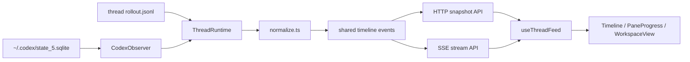

# AGENTS.md

This file is for agents, contributors, and maintainers working in this repository. It has two goals:

1. Help readers quickly understand the project structure and real data flow.
2. Keep key behavior stable while evolving the UI, event normalization, and multi-session workspace, without turning the product into a second wrapper around Codex CLI.

## Project Positioning

`codex-sidecar` is a **companion GUI for local Codex CLI sessions**.

Its core model is not "rebuild Codex invocation inside the GUI". Instead:

- Users continue to use native Codex CLI in the terminal.
- The server reads local Codex state and rollout logs.
- The frontend renders the event stream into a more readable workspace for review and multi-project monitoring.

This constraint is important. Unless a new design explicitly says otherwise, do not change the main path into a GUI-driven Codex caller.

## Quick Entry Points

When entering the codebase for the first time, read these files first:

- `src/server/index.ts`
  - HTTP API and SSE entry points
  - Production static asset serving
- `src/server/observer/CodexObserver.ts`
  - Project and thread aggregation
  - `ThreadRuntime` lifecycle management
- `src/server/observer/ThreadRuntime.ts`
  - Rollout log tailing
  - Incremental event delivery
- `src/server/observer/normalize.ts`
  - Normalizes raw Codex records into shared timeline events
- `src/shared/types.ts`
  - Shared frontend/backend event protocol
- `src/web/hooks/useThreadFeed.ts`
  - Snapshot loading and SSE subscription
- `src/web/lib/turns.ts`
  - Core logic for grouping timeline events by turn
- `src/web/lib/turnsCompaction.ts`
  - Merges compaction status events and hides replaced handoff summaries
- `src/web/lib/progress.ts`
  - Converts `update_plan` and assistant plans into the bottom progress area
- `src/web/components/Timeline.tsx`
  - Main timeline rendering
- `src/web/components/TimelineInspectors.tsx`
  - Tool detail modal and patch display
- `src/web/components/TimelinePatchFiles.tsx`
  - Inline patch file cards, including path-only deletes
- `src/web/state/workspace.ts`
  - Multi-pane workspace data model and persistence
- `docs/auto-workspace.md`
  - Auto main pane, bottom task tray, and capacity rules

## Real Data Flow


```mermaid
flowchart LR
    A["~/.codex/state_5.sqlite"] --> B["CodexObserver"]
    C["thread rollout.jsonl"] --> D["ThreadRuntime"]
    B --> D
    D --> E["normalize.ts"]
    E --> F["shared timeline events"]
    F --> G["HTTP snapshot API"]
    F --> H["SSE stream API"]
    G --> I["useThreadFeed"]
    H --> I
    I --> J["Timeline / PaneProgress / WorkspaceView"]
```

### Data Sources

- Default SQLite database path: `~/.codex/state_5.sqlite`
- Per-thread event source: the `rollout_path` stored in each thread record
- The server does not start Codex CLI calls. Its current job is reading, normalizing, and streaming.

### Frontend Consumption

- Initial thread load: `/api/threads/:id/snapshot`
- Incremental updates: `/api/threads/:id/stream`
- Project list: `/api/projects`
- Threads under a project: `/api/threads?cwd=...`

## Code Structure

### Server

- `src/server/index.ts`
  - REST and SSE endpoints
  - Production `dist/` hosting
- `src/server/observer/sqliteClient.ts`
  - Reads local Codex SQLite thread metadata
- `src/server/observer/CodexObserver.ts`
  - Caches `ThreadRuntime`
  - Aggregates project lists and thread pages
- `src/server/observer/ThreadRuntime.ts`
  - Incrementally reads rollout JSONL
  - Keeps event arrays and subscribers
- `src/server/observer/normalize.ts`
  - Detects message, tool, patch, status, and metric events
  - Changes here are the most likely to cause frontend/backend regressions
- `src/server/observer/normalizeCompaction.ts`
  - Compaction checkpoint and lifecycle mapping
  - Marks preceding handoff summaries for timeline removal

### Shared Layer

- `src/shared/types.ts`
  - Shared event protocol, thread summaries, and pagination types
  - Changes here usually require both server and frontend updates

### Frontend

- `src/web/hooks`
  - `useProjects.ts`: project list polling
  - `useThreadFeed.ts`: thread snapshot and SSE feed
- `src/web/state/workspace.ts`
  - Workspace tree structure
  - Multi-pane split, collapse, swap, orientation, and localStorage persistence
- `src/web/lib`
  - `turns.ts`: groups raw events into single-turn cards
  - `progress.ts`: bottom progress extraction
  - `commandSemantics.ts`: parses `exec_command` command semantics
  - `toolPresentation.ts`: tool preview labels
  - `diffViewData.ts`: patch diff preprocessing
- `src/web/components`
  - `ProjectSidebar.tsx`: project and thread sidebar
  - `WorkspaceView.tsx`: multi-pane container
  - `PaneView.tsx`: single thread pane
  - `Timeline.tsx`: timeline rendering
  - `TimelineInspectors.tsx`: tool detail and patch expansion UI
  - `TimelinePatchFiles.tsx`: inline patch file cards
  - `PaneProgress.tsx`: bottom progress bar

## Product Constraints

These behaviors are part of the current product semantics. Understand why they exist before changing them.

### 1. Keep The Native CLI + Sidecar Observer Model

- Do not default the project into "the GUI calls Codex internally".
- If GUI-initiated sessions are added later, keep them decoupled from the current observer path.

### 2. The Timeline Is Grouped By Turn, Not One Card Per Event

- A user request, assistant output, tool calls, and patch should belong to the same turn card.
- Relevant entry point: `src/web/lib/turns.ts`

### 3. `update_plan` Does Not Enter The Main Body

- `update_plan` appears in the bottom progress area.
- Plan mode assistant `<proposed_plan>` content is shown as plan content, not as bottom progress.
- Relevant entry point: `src/web/lib/progress.ts`

### 4. `write_stdin` Is Hidden From The Timeline By Default

- The current strategy filters it directly.
- This is intentional noise reduction, not missing data.

### 5. Exploration Commands Should Be Grouped

- `Search + Read + Read` should not degrade into many noisy cards.
- `parsed_cmd` is important to the current experience.
- Relevant entry points: `src/web/lib/commandSemantics.ts` and `src/web/lib/turns.ts`

### 6. Patches Are First-Class Information

- Patches are independent blocks.
- They are expanded by default and can be collapsed manually.
- If diff parsing fails, fall back to raw text instead of rendering an empty shell.
- Relevant entry points: `src/web/lib/diffViewData.ts`, `src/web/components/TimelineInspectors.tsx`, and `src/web/components/TimelinePatchFiles.tsx`

### 7. Do Not Display Token Usage

- This is a current product decision.
- It is acceptable to show `Context xx%` style context-window usage in pane headers.
- Do not render `token_count` in the timeline, and do not turn the product into a token, trace, or debug-metric observability platform.

### 8. Context Compaction Is A Status, Not Content

- A finished compaction should show a completed status, not stay on `Compacting context`.
- Compacted replacement history and the preceding handoff summary stay out of the timeline body.
- Relevant entry points: `src/server/observer/normalize.ts`, `src/server/observer/normalizeCompaction.ts`, and `src/web/lib/turnsCompaction.ts`

## Change Constraints

### Event Protocol Changes

If you modify any of these files:

- `src/server/observer/normalize.ts`
- `src/server/observer/normalizeCompaction.ts`
- `src/shared/types.ts`
- `src/web/lib/turns.ts`
- `src/web/lib/turnsCompaction.ts`
- `src/web/lib/progress.ts`

Do all three:

1. Check that the frontend/backend protocol still matches.
2. Update adjacent tests.
3. Manually verify at least one real thread page in the UI.

### UI Changes

For timeline UI changes, preserve this priority order:

1. Main content readability
2. Tool-call noise reduction
3. Code-change visibility
4. Multi-project switching efficiency

Do not flatten patches, tool rows, and assistant content into one generic card style just for visual consistency.

### Workspace Changes

- Multi-pane structure is owned by `workspace.ts`.
- Avoid scattering layout state in components.
- If layout interaction changes, keep localStorage compatibility in mind.

## Development Commands

### Local Development

```bash
pnpm install
pnpm dev
```

- Frontend dev port: `4316`
- Backend dev port: `4315`

### Checks And Build

```bash
pnpm test
pnpm check
pnpm build
```

## Testing Conventions

The project already keeps important pure logic in unit-testable layers. Prefer adding focused tests in these files:

- `src/server/observer/normalize.test.ts`
- `src/web/lib/commandSemantics.test.ts`
- `src/web/lib/diffViewData.test.ts`
- `src/web/lib/turns.test.ts`
- `src/web/lib/progress.test.ts`
- `src/web/state/workspace.test.ts`
- `src/web/components/*.test.ts`

Rules of thumb:

- Event normalization change: add `normalize` tests.
- Timeline grouping change: add `turns` tests.
- Progress extraction change: add `progress` tests.
- Patch/diff display change: add `diffViewData` or component tests.

## Pre-Commit Checks

Before committing, confirm:

- `pnpm test` passes.
- `pnpm build` passes.
- `node_modules/`, `dist/`, `dist-server/`, and `refs/` are not committed.
- Documentation does not describe behavior that is ahead of the implementation.

## Non-Goals

This repository is **not**:

- A new frontend shell that replaces Codex CLI
- A generic LLM chat UI
- An observability platform centered on tokens, traces, or debug metrics

This repository **is**:

- A monitoring and reading workspace around local Codex CLI
- A GUI that brings Markdown, tool calls, patches, and multi-project switching together

## Known Limitations

See [docs/known-limitations.md](docs/known-limitations.md) for deferred work and intentional trade-offs (including frontend performance follow-ups).
