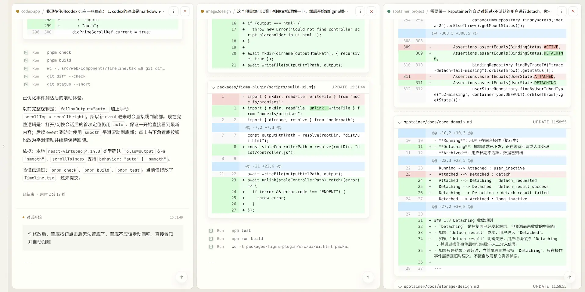

# Codex Sidecar

> A live companion UI for Codex CLI, with Markdown rendering and multi-project monitoring.

Codex Sidecar 是一个围绕 **本地 Codex CLI** 的伴随式 Web UI。你继续在终端里使用原生 Codex CLI，Sidecar 负责读取本机会话状态和 rollout 日志，把 Codex 输出实时渲染成更适合阅读、回看和并行监看的界面。

它不是重新包装一套 CLI，也不要求你换掉原来的工作流。它做的事情更克制：**保留原生 CLI 体验，只补上 Markdown 预览、多工程切换、工具调用聚合和代码修改可视化。**



上图是多个 Codex CLI 会话并行工作时的监看场景：左侧按项目聚合最近会话，右侧可以同时打开多个会话面板，实时查看正文输出、工具调用、patch 和进度状态。

## 为什么做这个项目

Codex CLI 在终端里很好用，但有两个天然痛点：

- 输出是 Markdown / 富结构内容，在纯 TUI 中阅读成本高。
- 多个项目同时跑时，需要来回切终端 tab 查看进度和交互。

Codex Sidecar 的目标就是解决这两个问题：把正文、工具调用、patch、进度分开展示，同时保持同一轮对话的上下文连续性；把多个工程和多个会话集中到一个工作区里切换、分屏和监看。

## 当前能力

- **原生 CLI 伴随模式**：不接管 Codex CLI 调用链，只读取本地状态并做 UI 增强。
- **实时会话监看**：读取本机 Codex 会话并流式更新，SSE 中断后也会用增量同步恢复状态。
- **Markdown 阅读增强**：正文支持 Markdown、表格、代码块、Mermaid 和本地文件预览。
- **工具调用降噪**：按语义展示工具调用，`Search / Read / List` 会聚合成探索块。
- **代码修改可视化**：patch 独立展示，支持 diff 预览、展开 / 收起和大 diff 快速回到顶部。
- **进度独立展示**：`update_plan` 渲染到底部进度栏，而不是混入正文噪音。
- **多工程与多会话**：左侧支持项目聚合、会话切换和活跃项目过滤。
- **并行工作区**：支持多线程分屏、折叠、换位、横竖切分，适合同时观察多个 Codex 任务。

本地启动：

```bash
pnpm install
pnpm dev
```

默认访问地址：

- Web UI: `http://127.0.0.1:4316`
- API: `http://127.0.0.1:4315`

## 设计原则

- 终端仍是主操作面，GUI 是伴随观察层。
- 正文优先可读，工具调用优先降噪。
- patch 是高优先级信息，不与普通工具输出混排。
- 多工程 / 多会话切换要比“炫技式 UI”更重要。
- 体验尽量贴近原生 Codex，而不是重新定义一套交互语义。

## 开发说明

如果你准备继续改这个项目，建议先读：

- `AGENTS.md`
- `src/server/observer/normalize.ts`
- `src/server/observer/ThreadRuntime.ts`
- `src/web/lib/turns.ts`
- `src/web/components/Timeline.tsx`
- `src/web/state/workspace.ts`

这些文件基本覆盖了事件采集、时间线聚合、状态恢复和多会话工作区的核心设计。
