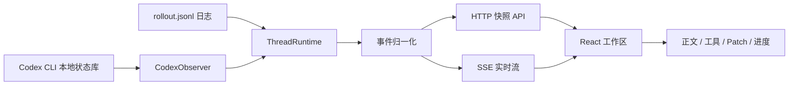

# Sidecar

> Real-time Markdown rendering and multi-project monitoring for Codex CLI.

Sidecar 是一个围绕 **本地 Codex CLI** 的伴随式工作台。  
你继续在终端里使用原生 Codex CLI，Sidecar 负责读取本机会话状态和 rollout 日志，把同一条会话实时渲染成更适合阅读和并行监看的 GUI。

它不是重新包装一套 CLI，也不是要求你换掉原来的工作流。  
它做的事情更克制：**保留原生 CLI 体验，只补上 Markdown 预览、多工程切换、工具调用聚合和代码修改可视化。**

## 为什么做这个项目

Codex CLI 在终端里很好用，但有两个天然痛点：

- 输出是 Markdown / 富结构内容，在纯 TUI 中阅读成本高
- 多个项目同时跑时，需要来回切终端 tab 看进度和交互

Sidecar 的目标就是解决这两个问题：

- 把正文、工具调用、patch、进度分开展示，但仍保持同一轮对话的上下文连续性
- 把多个工程 / 多个线程集中到一个工作区里切换和并排查看

## 当前能力

- 实时读取本机 Codex 会话并流式更新
- 正文支持 Markdown 渲染
- 工具调用按语义降噪展示
- `Search / Read / List` 聚合成探索块
- 代码修改单独提升为 patch 区块
- patch 支持 diff 预览与展开 / 收起
- `update_plan` 渲染到底部进度栏，而不是正文噪音
- 支持多工程侧栏浏览
- 支持多线程分屏、折叠、换位、横竖切分
- 保留“用户继续在原生终端使用 Codex CLI”的工作方式

## 工作方式



当前实现的核心原则是：

- **不接管 Codex CLI 调用链**
- **只读取本地状态并做 UI 增强**

这也是 Sidecar 和很多“在 GUI 里直接调用 AI coding agent”的工具最不一样的地方。

## 架构概览

### 后端

- 从 `~/.codex/state_5.sqlite` 读取项目和线程元数据
- 根据线程的 `rollout_path` 增量读取 rollout JSONL
- 把原始记录归一化成统一时间线事件
- 提供线程快照 API 和 SSE 增量流

### 前端

- 左侧展示工程与最近线程
- 中间工作区支持多分屏并排查看多个会话
- 每个会话面板实时显示：
  - 正文输出
  - 聚合后的探索 / 工具调用
  - patch diff
  - 进度栏

## 本地运行

### 依赖

- `pnpm` `10.x`
- 本机已经安装并使用过 Codex CLI
- 本地存在 Codex 的状态库与 rollout 数据

### 启动

```bash
pnpm install
pnpm dev
```

默认端口：

- Web UI: `http://127.0.0.1:4316`
- API: `http://127.0.0.1:4315`

## 常用命令

```bash
pnpm test
pnpm check
pnpm build
pnpm preview
```

## 设计原则

- 终端仍是主操作面，GUI 是伴随观察层
- 正文优先可读，工具调用优先降噪
- patch 是高优先级信息，不与普通工具输出混排
- 多工程 / 多线程切换要比“炫技式 UI”更重要
- 体验尽量贴近原生 Codex，而不是重新定义一套交互语义

## 当前状态

项目当前更适合：

- 本地自用
- 对 Codex CLI 有深度使用习惯的开发者
- 想保留终端工作流，但希望提升阅读与监看体验的人

它目前还不是一个“通用 AI IDE”，而是一个面向 Codex CLI 的专用 companion UI。

## 开发说明

如果你准备继续改这个项目，建议先读：

- `AGENTS.md`
- `src/server/observer/normalize.ts`
- `src/web/lib/turns.ts`
- `src/web/components/Timeline.tsx`
- `src/web/state/workspace.ts`

这些文件基本覆盖了事件采集、时间线聚合和多会话工作区的核心设计。
