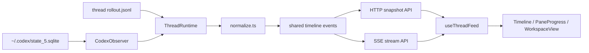

# Codex Sidecar

> A lightweight companion UI for monitoring many local Codex CLI coding sessions in real time.

[简体中文](./README.zh-CN.md) · [License](./LICENSE)

Codex Sidecar is built for developers who like the directness of **Codex CLI** but do not want to lose visibility when several AI coding tasks run across different projects.

The full Codex app can feel heavier than needed if your main workflow already lives in the terminal. Codex CLI stays fast and familiar, but terminal tabs make it hard to answer simple operational questions: which project is still running, which turn needs review, where did the patch land, and what changed while you were looking elsewhere.

Codex Sidecar keeps the CLI as the source of truth and adds a browser-based monitoring workspace next to it. It **reads** local Codex state and rollout logs, then renders each session as a live timeline with Markdown, tool calls, patches, progress, and multi-project context.


The screenshot shows the intended use case: several Codex CLI sessions running in parallel, grouped by project, with rich Markdown and Mermaid rendering inside the browser workspace.

## Highlights

What makes Codex Sidecar different from a generic chat UI:

- **Read-only observer, zero interference.** It only reads your local Codex SQLite state and rollout logs. It never launches, drives, or wraps Codex CLI, and it never writes to your Codex data. Everything stays on your machine.
- **Resilient live streaming.** Sessions stream over SSE with a cursor-based incremental sync. If the connection drops, it resumes from the last cursor instead of replaying everything, with a periodic poll as a fallback.
- **Turn-grouped timeline.** A user request, the assistant reply, its tool calls, and the resulting patch are grouped into a single turn card instead of scattering into one card per event.
- **Tool-call noise reduction.** Exploration commands (`grep`/`rg`/`find`/`fd`/`ls`/`cat`/`sed -n` …) are parsed by semantics and folded into compact `Search / Read / List` runs.
- **Patches as first-class artifacts.** Each patch is an independent diff block, rendered with a real diff viewer, expanded by default, collapsible, and gracefully falls back to raw text when a diff cannot be parsed.
- **Plan goes to the progress bar.** `update_plan` is extracted into a dedicated bottom progress area instead of polluting the main response.
- **Parallel multi-pane workspace.** Split panes horizontally or vertically, collapse, and swap siblings; the layout is persisted in `localStorage`.
- **Rich rendering.** Markdown, GFM tables, syntax-highlighted code, Mermaid diagrams (with fullscreen), and local file previews (Markdown / image / PDF / code, with type and size limits).

## Why This Exists

Codex CLI is a good place to drive coding work, but it has two practical limits during parallel work:

- Rich Markdown, tool calls, and patches are harder to scan in a terminal-only interface.
- Multiple projects running at once require constant terminal tab switching to understand status.

Codex Sidecar fills that visibility gap without replacing your CLI workflow. You keep launching and interacting with Codex in the terminal, while the web UI gives you a readable control room for monitoring ongoing and finished sessions.

## Requirements

- **Node.js** >= 20.19 (Vite 7 requirement)
- **pnpm** (the repo pins `pnpm@10.28.0` via `packageManager`)
- **sqlite3** command-line tool available on `PATH` (used to read the local Codex state database)
- A local **Codex CLI** installation that has produced state at `~/.codex/state_5.sqlite` and rollout logs

## Quick Start

```bash
git clone https://github.com/Zzzia/codex-sidecar.git
cd codex-sidecar
pnpm install
pnpm dev
```

Default local URLs:

- Web UI: `http://127.0.0.1:4316`
- API: `http://127.0.0.1:4315`

> The API port can be overridden with the `PORT` environment variable. The Codex state path (`~/.codex/state_5.sqlite`) is currently fixed.

## Production Build

```bash
pnpm build      # builds the web client (dist) and the server (dist-server)
pnpm preview    # serves the built app in production mode
```

In production mode the server hosts the built front-end static assets and falls back to `index.html` for client-side routes.

## Privacy

Codex Sidecar runs entirely on your machine. It reads your local Codex SQLite state, rollout logs, and (on demand) local files referenced by a session for preview. Nothing is uploaded anywhere, and it does not write back to your Codex data.

## Design Principles

- The terminal remains the primary interaction surface; the browser is an observation layer.
- Readability of assistant output comes before visual decoration.
- Tool calls should be compressed into useful signals instead of becoming timeline noise.
- Patches are high-priority artifacts and should not be buried inside generic tool output.
- Multi-project and multi-session switching matters more than a flashy chat UI.
- The product should stay close to native Codex semantics instead of inventing a second workflow.

## How It Works


```mermaid
flowchart LR
    A["~/.codex/state_5.sqlite"] --> B["CodexObserver"]
    C["thread rollout.jsonl"] --> D["ThreadRuntime"]
    B --> D
    D --> E["normalize.ts"]
    E --> F["shared timeline events"]
    F --> G["HTTP snapshot API"]
    F --> H["SSE stream API"]
    G --> I["useThreadFeed"]
    H --> I
    I --> J["Timeline / PaneProgress / WorkspaceView"]
```

## Contributing

Contributions are welcome. If you plan to change the project, start with these files:

- `AGENTS.md` — project positioning, product constraints, and change rules
- `src/server/observer/normalize.ts` — raw Codex records into shared timeline events
- `src/server/observer/ThreadRuntime.ts` — rollout tailing and incremental delivery
- `src/web/lib/turns.ts` — timeline grouping by turn
- `src/web/components/Timeline.tsx` — timeline rendering
- `src/web/state/workspace.ts` — multi-pane workspace model

Before opening a pull request:

```bash
pnpm test     # unit tests for normalize / turns / progress / diff / workspace
pnpm check    # TypeScript type checking
pnpm build    # production build
```

Please keep the native-CLI + read-only-observer model intact unless a change is explicitly designed to evolve it. See the constraints in `AGENTS.md`.

## License

[MIT](./LICENSE) © Zzzia
