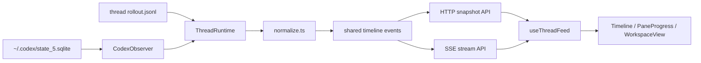

# Codex Sidecar

> A lightweight companion UI for monitoring many Codex CLI coding sessions in real time.

[Chinese](./README.zh-CN.md)

Codex Sidecar is built for developers who like the directness of **Codex CLI** but do not want to lose visibility when several AI coding tasks are running across different projects.

The full Codex app can feel heavier than needed if your main workflow already lives in the terminal. Codex CLI stays fast and familiar, but terminal tabs make it hard to answer simple operational questions: which project is still running, which turn needs review, where did the patch land, and what changed while you were looking elsewhere.

Codex Sidecar keeps the CLI as the source of truth and adds a browser-based monitoring workspace next to it. It reads local Codex state and rollout logs, then renders each session as a live timeline with Markdown, tool calls, patches, progress, and multi-project context.


The screenshot shows the intended use case: several Codex CLI sessions running in parallel, grouped by project, with rich Markdown and Mermaid rendering inside the browser workspace.

## Why This Exists

Codex CLI is a good place to drive coding work, but it has two practical limits during parallel work:

- Rich Markdown, tool calls, and patches are harder to scan in a terminal-only interface.
- Multiple projects running at once require constant terminal tab switching to understand status.

Codex Sidecar fills that visibility gap without replacing your CLI workflow. You keep launching and interacting with Codex in the terminal, while the web UI gives you a readable control room for monitoring ongoing and finished sessions.

## Features

- **Native CLI sidecar mode**: does not call or wrap Codex CLI; it only observes local state and logs.
- **Live session monitoring**: streams local Codex session updates and recovers with incremental sync after SSE interruptions.
- **Markdown and Mermaid rendering**: renders Markdown, tables, code blocks, Mermaid diagrams, and local file previews.
- **Tool-call noise reduction**: groups semantic exploration commands such as search, read, and list operations.
- **Patch visibility**: shows patches as first-class timeline blocks with diff previews and expand/collapse behavior.
- **Separate progress area**: renders `update_plan` in the bottom progress bar instead of mixing it into the main response.
- **Fast turn navigation**: jumps back to the current turn top in long timelines without manual scrolling.
- **Multi-project awareness**: groups sessions by working directory and highlights active projects.
- **Parallel workspace**: supports multiple panes, pinning, archiving, swapping, collapsing, and horizontal/vertical splits.

## Quick Start

```bash
git clone https://github.com/Zzzia/codex-sidecar.git
cd codex-sidecar
pnpm install
pnpm dev
```

Default local URLs:

- Web UI: `http://127.0.0.1:4316`
- API: `http://127.0.0.1:4315`

## Design Principles

- The terminal remains the primary interaction surface; the browser is an observation layer.
- Readability of assistant output comes before visual decoration.
- Tool calls should be compressed into useful signals instead of becoming timeline noise.
- Patches are high-priority artifacts and should not be buried inside generic tool output.
- Multi-project and multi-session switching matters more than a flashy chat UI.
- The product should stay close to native Codex semantics instead of inventing a second workflow.

## How It Works


```mermaid
flowchart LR
    A["~/.codex/state_5.sqlite"] --> B["CodexObserver"]
    C["thread rollout.jsonl"] --> D["ThreadRuntime"]
    B --> D
    D --> E["normalize.ts"]
    E --> F["shared timeline events"]
    F --> G["HTTP snapshot API"]
    F --> H["SSE stream API"]
    G --> I["useThreadFeed"]
    H --> I
    I --> J["Timeline / PaneProgress / WorkspaceView"]
```

## Development Notes

If you plan to change the project, start with these files:

- `AGENTS.md`
- `src/server/observer/normalize.ts`
- `src/server/observer/ThreadRuntime.ts`
- `src/web/lib/turns.ts`
- `src/web/components/Timeline.tsx`
- `src/web/state/workspace.ts`

They cover the core event ingestion, timeline grouping, stream recovery, and multi-session workspace behavior.
