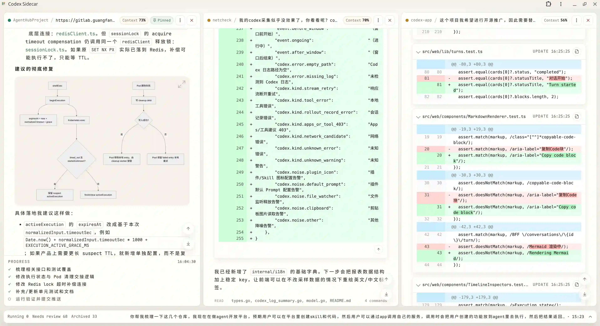
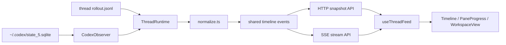

# Codex Sidecar

> 一个用于实时监看多个本地 Codex CLI AI coding 会话的轻量 Web 伴随界面。

[English](./README.md) · [开源许可](./LICENSE)

Codex Sidecar 面向仍然喜欢使用 **Codex CLI** 的开发者：终端里的 CLI 足够直接，但当多个项目同时跑 AI coding 任务时，很难直观看到每个项目的实时状态。

完整的 Codex app 对这类工作流来说可能显得臃肿。如果你主要还是在终端里启动和交互，Codex CLI 更轻、更贴近原生体验；但终端 tab 很难快速回答这些问题：哪个项目还在运行，哪一轮需要查看，patch 改到了哪里，刚才没盯着时发生了什么。

Codex Sidecar 保持 CLI 作为真实工作入口，只在旁边增加一个浏览器监看工作台。它**只读取**本地 Codex 状态库和 rollout 日志，把每个会话渲染成包含 Markdown、工具调用、patch、进度和多项目上下文的实时 Timeline。



上图展示的是目标场景：多个 Codex CLI 会话在不同项目中并行运行，浏览器中可以按项目聚合，并在工作区里直接渲染 Markdown 和 Mermaid 图表。

## 核心亮点

相比通用聊天 UI，Codex Sidecar 的差异化在于：

- **只读观察，零干扰**：仅读取本地 Codex SQLite 状态库和 rollout 日志，从不启动、驱动或包装 Codex CLI，也不会写入你的 Codex 数据。所有数据都留在本机。
- **稳健的实时流**：会话通过 SSE 流式推送，并采用基于游标的增量同步。连接中断时从上次游标续传，而不是重放全部事件，另有定时轮询兜底。
- **按轮次分组的时间线**：一次用户请求、assistant 回复、其工具调用和产出的 patch 会聚合到同一张 turn 卡，而不是每个事件一张卡。
- **工具调用降噪**：按语义解析探索类命令（`grep`/`rg`/`find`/`fd`/`ls`/`cat`/`sed -n` 等），折叠成紧凑的 `Search / Read / List` 运行块。
- **Patch 一等公民**：每个 patch 是独立 diff 块，用真实的 diff 视图渲染，默认展开、可收起；diff 解析失败时优雅回退为原始文本。
- **计划独立到进度栏**：`update_plan` 提取到底部专属进度区，不污染正文。
- **并行多面板工作区**：面板可横向/纵向切分、折叠、与同级互换位置；布局通过 `localStorage` 持久化。
- **富内容渲染**：Markdown、GFM 表格、代码高亮、Mermaid 图表（支持全屏）、本地文件预览（Markdown / 图片 / PDF / 代码，含类型与大小限制）。

## 为什么做这个项目

Codex CLI 很适合作为 coding 主入口，但在多项目并行时有两个现实痛点：

- Markdown、工具调用和 patch 这类富结构内容，在纯终端里不够容易扫读。
- 多个项目同时运行时，需要不断切换终端 tab 才能了解状态。

Codex Sidecar 解决的是这个“可视化监看”缺口，而不是替代 CLI。你继续在终端里启动和操作 Codex，Web UI 负责把进行中和已完成的会话集中展示出来，方便阅读、回看和并行监看。

## 环境要求

- **Node.js** >= 20.19（Vite 7 的要求）
- **pnpm**（仓库通过 `packageManager` 锁定 `pnpm@10.28.0`）
- 系统 `PATH` 中可用的 **sqlite3** 命令行工具（用于读取本地 Codex 状态库）
- 本地已安装并使用过 **Codex CLI**，已在 `~/.codex/state_5.sqlite` 生成状态库及 rollout 日志

## 快速启动

```bash
git clone https://github.com/Zzzia/codex-sidecar.git
cd codex-sidecar
pnpm install
pnpm dev
```

默认本地地址：

- Web UI: `http://127.0.0.1:4316`
- API: `http://127.0.0.1:4315`

> API 端口可通过环境变量 `PORT` 覆盖。Codex 状态库路径（`~/.codex/state_5.sqlite`）目前为固定值。

## 生产构建

```bash
pnpm build      # 构建前端（dist）与服务端（dist-server）
pnpm preview    # 以生产模式启动
```

生产模式下，服务端会托管构建后的前端静态资源，并对客户端路由回退到 `index.html`。

## 隐私说明

Codex Sidecar 完全在本机运行。它读取本地 Codex SQLite 状态库、rollout 日志，以及（按需）会话引用的本地文件用于预览。不会上传到任何地方，也不会回写你的 Codex 数据。

## 设计原则

- 终端仍然是主操作面，浏览器只是观察层。
- assistant 正文可读性优先于视觉装饰。
- 工具调用应该被压缩成有用信号，而不是时间线噪音。
- patch 是高优先级产物，不应埋在普通工具输出里。
- 多项目和多会话切换效率比花哨的聊天 UI 更重要。
- 产品体验应尽量贴近原生 Codex 语义，不重新发明一套工作流。

## 工作方式



## 参与贡献

欢迎贡献。如果准备继续修改项目，建议先读这些文件：

- `AGENTS.md` —— 项目定位、产品约束与改动规则
- `src/server/observer/normalize.ts` —— 原始 Codex 记录归一化为共享时间线事件
- `src/server/observer/ThreadRuntime.ts` —— rollout 日志增量读取与下发
- `src/web/lib/turns.ts` —— 时间线按轮次分组
- `src/web/components/Timeline.tsx` —— 时间线渲染
- `src/web/state/workspace.ts` —— 多面板工作区模型

提交 PR 前请确认：

```bash
pnpm test     # normalize / turns / progress / diff / workspace 等单元测试
pnpm check    # TypeScript 类型检查
pnpm build    # 生产构建
```

除非改动明确是为了演进它，否则请保持“原生 CLI + 只读观察”的模型不变。详见 `AGENTS.md` 中的约束。

## 开源许可

[MIT](./LICENSE) © Zzzia
