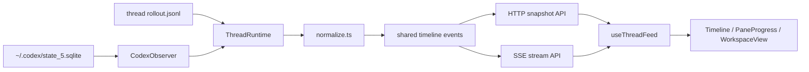

# Codex Sidecar

> 一个用于实时监看多个 Codex CLI AI coding 会话的轻量 Web 伴随界面。

[English](./README.md)

Codex Sidecar 面向仍然喜欢使用 **Codex CLI** 的开发者：终端里的 CLI 足够直接，但当多个项目同时跑 AI coding 任务时，很难直观看到每个项目的实时状态。

完整的 Codex app 对这类工作流来说可能显得臃肿。如果你主要还是在终端里启动和交互，Codex CLI 更轻、更贴近原生体验；但终端 tab 很难快速回答这些问题：哪个项目还在运行，哪一轮需要查看，patch 改到了哪里，刚才没盯着时发生了什么。

Codex Sidecar 保持 CLI 作为真实工作入口，只在旁边增加一个浏览器监看工作台。它读取本地 Codex 状态库和 rollout 日志，把每个会话渲染成包含 Markdown、工具调用、patch、进度和多项目上下文的实时 Timeline。


上图展示的是目标场景：多个 Codex CLI 会话在不同项目中并行运行，浏览器中可以按项目聚合，并在工作区里直接渲染 Markdown 和 Mermaid 图表。

## 为什么做这个项目

Codex CLI 很适合作为 coding 主入口，但在多项目并行时有两个现实痛点：

- Markdown、工具调用和 patch 这类富结构内容，在纯终端里不够容易扫读。
- 多个项目同时运行时，需要不断切换终端 tab 才能了解状态。

Codex Sidecar 解决的是这个“可视化监看”缺口，而不是替代 CLI。你继续在终端里启动和操作 Codex，Web UI 负责把进行中和已完成的会话集中展示出来，方便阅读、回看和并行监看。

## 当前能力

- **原生 CLI 伴随模式**：不调用、不包装 Codex CLI，只观察本地状态和日志。
- **实时会话监看**：流式展示本地 Codex 会话更新，SSE 中断后通过增量同步恢复。
- **Markdown 和 Mermaid 渲染**：支持 Markdown、表格、代码块、Mermaid 图表和本地文件预览。
- **工具调用降噪**：按语义聚合 search、read、list 等探索类命令。
- **代码修改可视化**：patch 作为一等信息展示，支持 diff 预览、展开和收起。
- **进度独立展示**：`update_plan` 渲染到底部进度栏，不混入正文噪音。
- **快速回到当前轮**：长时间线中可一键跳回当前轮对话顶部，避免手动滚动查找。
- **多工程感知**：按工作目录聚合会话，并突出活跃项目。
- **并行工作区**：支持多面板、固定、收纳、换位、折叠和横竖切分。

## 快速启动

```bash
git clone https://github.com/Zzzia/codex-sidecar.git
cd codex-sidecar
pnpm install
pnpm dev
```

默认本地地址：

- Web UI: `http://127.0.0.1:4316`
- API: `http://127.0.0.1:4315`

## 设计原则

- 终端仍然是主操作面，浏览器只是观察层。
- assistant 正文可读性优先于视觉装饰。
- 工具调用应该被压缩成有用信号，而不是时间线噪音。
- patch 是高优先级产物，不应埋在普通工具输出里。
- 多项目和多会话切换效率比花哨的聊天 UI 更重要。
- 产品体验应尽量贴近原生 Codex 语义，不重新发明一套工作流。

## 工作方式



## 开发说明

如果准备继续修改项目，建议先读：

- `AGENTS.md`
- `src/server/observer/normalize.ts`
- `src/server/observer/ThreadRuntime.ts`
- `src/web/lib/turns.ts`
- `src/web/components/Timeline.tsx`
- `src/web/state/workspace.ts`

这些文件覆盖了事件采集、时间线聚合、流式恢复和多会话工作区的核心行为。
