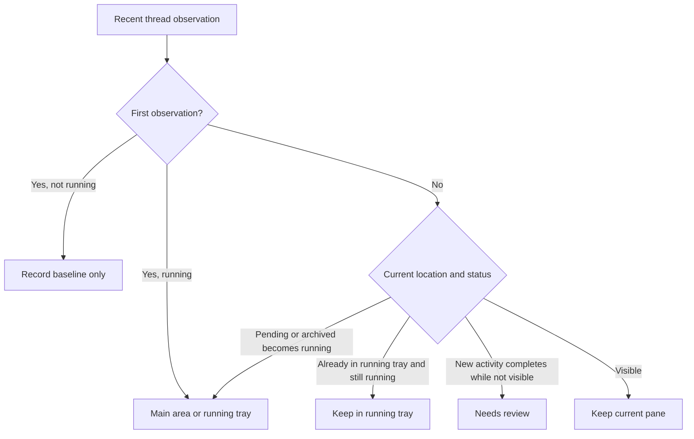

# Auto Workspace and Task Tray

The auto workspace keeps active Codex CLI sessions in the main pane area and moves overflow or review-ready sessions into the bottom task tray.

## State Sources

- Recent CLI session observations come from `GET /api/threads/recent` every three seconds.
- The first observation establishes a baseline without importing completed history into the tray.
- Later `updatedAt` changes are persisted with the auto workspace, so sessions that finish between polls are still discovered.
- The main pane capacity is persisted separately in `codex-app.auto-workspace.max-panes.v1`.
- Auto workspace state is persisted separately in `codex-app.auto-workspace.v1`; it does not migrate the legacy `codex-app.workspace.v1` value.

## Main Pane Rules

- The default capacity is 3 sessions, and the UI supports `2 / 3 / 4 / 5 / 6`.
- Newly discovered running sessions enter the main area first; when the main area is full, they enter the tray's running group.
- Pending or archived sessions that resume are treated as running again and re-enter the main area or the running tray.
- A running session already parked in the tray stays there until capacity changes or the user pins it.
- Sessions manually pinned to the main area are fixed and are not automatically evicted.
- When capacity is reduced, unpinned sessions are removed first. If the pinned count exceeds the new limit, the app does not force-close them.
- When capacity is increased, running tray sessions are added back to the main area by most recent update time.

## Tray Rules

- The tray is collapsed as a floating bottom bar by default and does not participate in split-pane layout.
- The tray has three groups: needs review, running, and archived.
- Running sessions in the tray move to needs review after they finish.
- Sessions first observed as completed after the baseline also enter needs review.
- Clicking a tray item opens a full-screen preview only; it does not change the main pane layout.
- Closing a needs-review preview or clicking "Reviewed and archived" moves the session to archived.
- Archived keeps the latest 50 sessions. Once the list is around 10 items tall, it scrolls internally.
